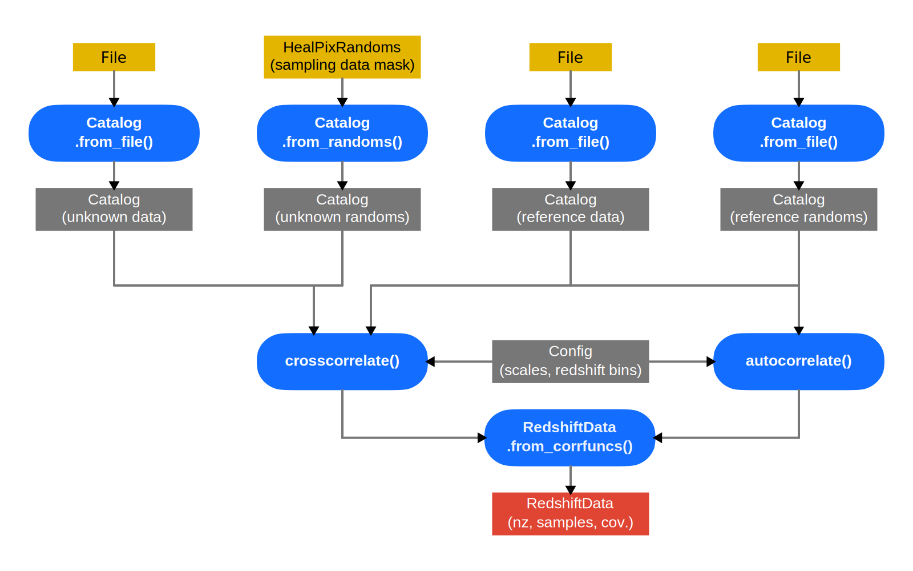

.. _api:

API reference
=============

This is a documentation of the most important parts of the *yet_another_wizz*
(``yaw``) python API. For a more general introduction with examples refer to the
:ref:`user guide<guide>`. The flowchart below roughly indicates the rough
relationship between the most import data containers.

.. dropdown:: :octicon:`list-ordered;1.5em` ‎ ‎ ‎ Table of contents
    :margin: 0
    :color: muted
    :class-title: h5

    .. toctree::
        :maxdepth: 2

        api/catalogs
        api/config
        api/core
        api/correlation
        api/fitting
        api/randoms
        api/redshifts

