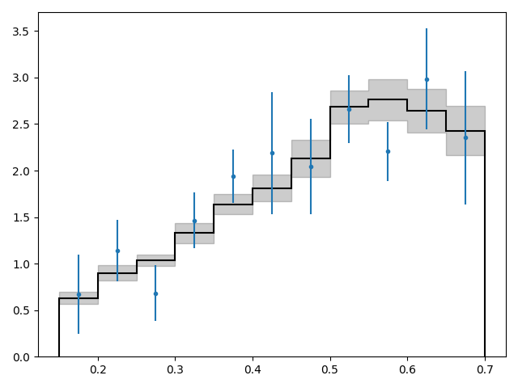

.. _quickapi:

Using the API
-------------

The third and most flexible way to use *yet_another_wizz* is through its python
API. Here we follow exactly the :ref:`previous example<quickcmd>` and produce
the same clustering redshift estimate.

The first step is to import the python package:

.. code-block:: python

    >>> import yaw

Loading the data
^^^^^^^^^^^^^^^^

All input data must be loaded as data catalogs, which can be done through the
:class:`~yaw.catalogs.NewCatalog` factory class:

.. code-block:: python

    >>> factory = yaw.NewCatalog()

Next we load the reference sample. We want to split the data 32
:ref:`spatial patches<patches>` that allow us later to get uncertainties for our
clustering redshift measurements. By default these are generated automatically
with a k-means clustering algorithm when passing an integer to ``patches``:

.. code-block:: python

    >>> reference = factory.from_file(
    ...     "reference.fits", ra="ra", dec="dec", redshift="z", patches=32)
    >>> reference
    ScipyCatalog(loaded=True, nobjects=389596, npatches=32, redshifts=True)

Now we can load the remaining catalogs. It is necessary that all catalogs use
*exactly* the same patch centers, which we directly assign from the reference
catalog using the ``patches`` parameter:

.. code-block:: python

    >>> randoms = factory.from_file(
    ...     "ref_rand.fits", patches=reference, ra="ra", dec="dec", redshift="z")
    >>> unknown = factory.from_file(
    ...     "unknown.fits",  patches=reference, ra="ra", dec="dec")

Measuring correlations
^^^^^^^^^^^^^^^^^^^^^^

Next we construct a central :class:`~yaw.config.Config` object that sets the
minimal required parameters, the physical scales (in kpc)and the redshift
binning that we want to use for the correlation measurements:

.. code-block:: python

    >>> config = yaw.Config.create(rmin=100, rmax=1000, zmin=0.07, zmax=1.42)

Then we measure the correlation amplitudes using the
:func:`~yaw.correlation.crosscorrelate` and
:func:`~yaw.correlation.autocorrelate` functions. The latter allows to correct
for the reference sample galaxy bias:

.. code-block:: python

    >>> w_sp = yaw.crosscorrelate(config, reference, unknown, ref_rand=randoms)
    >>> w_ss = yaw.autocorrelate(config, reference, randoms, compute_rr=True)
    >>> w_ss
    CorrFunc(n_bins=30, z='0.070...1.420', dd=True, dr=True, rd=False, rr=True, n_patches=32)

By inspecting the result we can see that this produced a
:class:`~yaw.correlation.CorrFunc` object with the desired binning and pair
counts data-data, data-random and random-random.

Getting the clustering redshifts
^^^^^^^^^^^^^^^^^^^^^^^^^^^^^^^^

Finally we can obtain our reference-sample-bias corrected clustering redshfit
estimate with a single line using the :class:`~yaw.correlation.RedshiftData`
container:

.. code-block:: python

    >>> n_cc = yaw.RedshiftData.from_correlation_functions(w_sp, w_ss)
    >>> n_cc
    RedshiftData(n_bins=30, z='0.070...1.420', n_samples=32, method='jackknife')

This object contains the redshift data and an error and covariance estimate
computed from 32 jackknife realisations, based on the 32 spatial patches we
created earlier. We can get a preview by using the builting plotting method:

.. code-block:: python

    >>> n_cc.plot(zero_line=True)

Storing the outputs
^^^^^^^^^^^^^^^^^^^

Finally we can save those outputs to disk and reload them as needed, e.g.:

.. code-block:: python

    >>> w_ss.to_file("w_ss.hdf5")
    >>> w_ss.from_file("w_ss.hdf5")
    CorrFunc(n_bins=30, z='0.070...1.420', dd=True, dr=True, rd=False, rr=True, n_patches=32)

.. code-block:: python

    >>> n_cc.to_files("n_cc")
    >>> n_cc.from_files("n_cc")
    RedshiftData(n_bins=30, z='0.070...1.420', n_samples=32, method='jackknife')

For the latter we did not give a file extension, because the redshift data is
stored in three separate files, one for the data and redshift estimate, one
for the jackknife/bootstrap samples and one for the covariance matrix.

.. code-block:: bash

    $ ls
    n_cc.cov
    n_cc.dat
    n_cc.smp
    w_ss.hdf5
